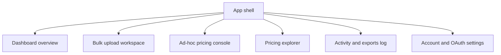

# Frontend Experience Plan

## Persona Snapshot
- **Primary persona**: Cloud architect delivering cost optimization for enterprise customers.
- **Motivations**: accelerate discovery of optimal pricing models, validate recommendations with defensible data.
- **Context**: works within tight project timelines, often juggling multiple customer environments.
- **Pain points**: manual spreadsheet workflows, inconsistent pricing datasets, limited time for what-if analysis.

## Key User Journeys
1. **Bulk pricing upload**
   - Trigger: architect receives exported inventory from customer.
   - Actions: download template, upload CSV or Excel, review parsed summary, submit to `/price-instances`, inspect results.
   - Outcome: cleaned dataset with scenario costs and export options.
2. **Ad-hoc price query**
   - Trigger: needs quick comparison for a single or handful of instances.
   - Actions: choose region, instance type, operating system, tenancy, quantity; call `/price-instance`; view pricing scenario chips.
   - Outcome: rapid validation without file preparation.
3. **Scenario dashboard review**
   - Trigger: wants to compare strategies (on-demand, savings plans, reserved instances) across workloads.
   - Actions: open dashboard, filter by workload tags, toggle savings plan types, analyze charts, export findings.
   - Outcome: actionable recommendation set for stakeholder presentation, with export-ready comparison artifacts.
4. **Pricing database exploration**
   - Trigger: needs visibility into cataloged pricing records.
   - Actions: apply filters, fetch `/query-pricing-data`, pivot by contract term.
   - Outcome: insights into coverage gaps or anomalies.
5. **Results export & sharing**
   - Trigger: architect must deliver findings to customer stakeholders.
   - Actions: select CSV, Excel, or Google Sheets export; authenticate via OAuth for Sheets; choose data scope (bulk upload results, filtered dashboard, ad-hoc comparisons); confirm export and capture audit trail.
   - Outcome: portable deliverables aligned with customer reporting preferences.

## Information Architecture
- **App shell**: persistent sidebar with workspace navigation and environment selector; header with tenant switcher and session status.
- **Primary navigation**:
  - Dashboard overview (default landing).
  - Bulk upload workspace.
  - Ad-hoc pricing console.
  - Pricing explorer.
  - Activity and exports log.
  - Account and OAuth settings.
- **Secondary navigation**: within each workspace use `Tabs` for context-specific subtasks (e.g., Results vs. Data issues).

## Layout Patterns and Shadcn Components
| Journey section | Layout strategy | Shadcn components | Notes |
| --- | --- | --- | --- |
| App shell | Sidebar layout with sticky header | `Sidebar`, `NavigationMenu`, `Avatar`, `DropdownMenu`, `ThemeToggle` | Responsive collapse for tablet and phone |
| Bulk upload | Two-column canvas (left input, right results) | `Card`, `Tabs`, `FileUpload` (custom over `Input` + dropzone), `Button`, `Alert`, `Progress` | Support drag-and-drop with parse status indicators |
| Ad-hoc console | Form grid + results panel | `Form`, `Select`, `Combobox`, `Input`, `NumberInput`, `Badge`, `Button`, `Accordion` | Persist last query in local storage |
| Dashboard | Split view charts + table | `Tabs`, `DataTable` (with `Table`, `ScrollArea`), `ToggleGroup`, `Checkbox`, `Badge`, `Tooltip`, `Skeleton` | Integrate charting with `@nivo` or `recharts` alongside Shadcn cards |
| Pricing explorer | Dense table with filters | `Toolbar`, `Combobox`, `MultiSelect`, `DataTable`, `Pagination`, `Separator` | Enable saved filter presets |
| Activity log | Timeline style | `Timeline`, `Accordion`, `Badge`, `Button`, `Sheet` | Provide export summary drawer |
| Authentication & exports | Split settings and export history panels | `Card`, `Form`, `Input`, `Button`, `Separator`, `Alert`, `Badge`, `Dialog` | Manage OAuth connection, token status, re-auth prompts |

## Data Flow and API Integration
- Adopt React Query for mutation and caching of `/price-instance`, `/price-instances`, `/query-pricing-data`, and export triggers.
- Centralize API layer in `frontend/src/lib/api.ts` with typed request and response contracts mirroring [`api-backend/main.py`](api-backend/main.py:592) and forthcoming export endpoints.
- Use optimistic state where feasible (e.g., queue uploads, enqueue exports) and invalidate caches on successful submissions.
- Stream large result sets with pagination and server-driven filtering to keep responses performant.
- Capture request metadata (duration, payload size, export type) and forward to backend logging via custom headers.
- Manage OAuth tokens via a dedicated auth context, storing refresh metadata securely and attaching tokens to Google Sheets export calls.

## Dashboard Comparison and Visualization Strategy
- Aggregate totals by scenario and highlight deltas versus on-demand as primary baseline.
- Provide `SummaryCard` grid showing lowest total cost, projected savings, and breakeven hours.
- Display scenario matrix with grouped columns per contract term; allow column visibility toggles.
- Offer stacked bar chart for TCO distribution and line chart for cumulative savings over time.
- Enable scenario filters: plan type, term length, upfront structure, operating system, workload tag.
- Include detail drawer revealing BigQuery source references, export history, and assumptions per scenario.

## Error Handling, Loading, and Observability
- Standardize API errors into domain-friendly messages; surface using Shadcn `Alert` and `Toast`.
- Use skeleton states for dashboard cards and tables; show stepped progress during file parsing.
- Log front-end events (upload started, pricing complete, export triggered, OAuth refresh) through a telemetry hook that forwards to backend for Cloud Logging ingestion.
- Provide retry affordances for transient failures, OAuth re-auth prompts, and guidance for schema mismatches.

## Accessibility and Performance Considerations
- Maintain WCAG AA contrast, ensure focus outlines, and use ARIA labels on all interactive controls.
- Support full keyboard navigation in tables via roving tabindex and skip links.
- Defer non-critical charts with dynamic imports and leverage virtualization for large tables.
- Offer reduced motion mode toggled through preferences.
- Provide verbose descriptions for complex metrics using `Tooltip` and `VisuallyHidden`.
- Ensure OAuth consent dialogs and export status modals are screen-reader friendly with proper focus trapping.

## Next Planning Actions
- Define data contracts and TypeScript models for pricing responses.
- Draft component architecture diagrams for upload pipeline and dashboard state.
- Prepare task breakdown for Code mode implementation, starting with project scaffolding, Shadcn setup, and OAuth/export infrastructure.