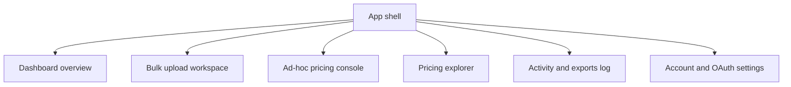
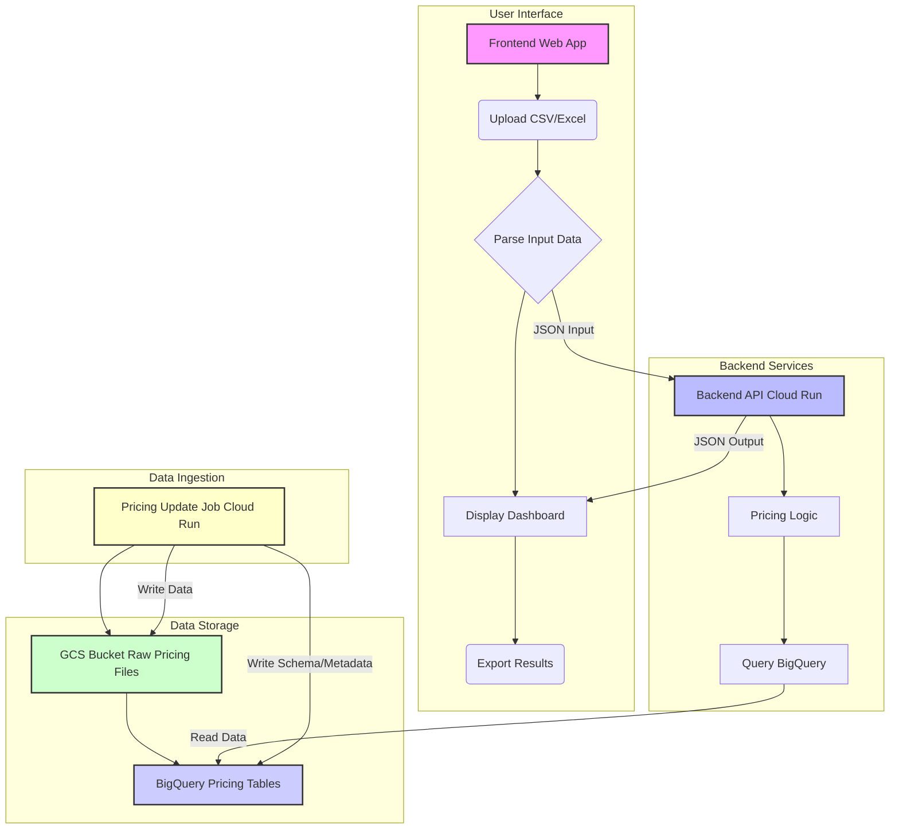

# AWS EC2 Cost Optimization Application - Development Plan

This document outlines the plan for developing the Backend API and Frontend components of the AWS EC2 Cost Optimization application. The Pricing Update Job component is already complete and responsible for ingesting AWS pricing data into BigQuery.

## Project Overview

The application consists of three main components:

1.  **Pricing Update Job (Completed)**: Downloads AWS pricing files and stores them in BigQuery.
2.  **Backend API (To be built)**: Provides an API for the frontend to price out AWS EC2 instances. It will query pricing data from BigQuery and return cost comparisons.
3.  **Frontend (To be built)**: A web interface for users to upload EC2 instance data (CSV/Excel), view pricing comparisons in a dashboard, and export results.

## Current Status

*   `pricing-update-job` is complete.
*   `api-backend` has a basic FastAPI setup.
*   `frontend` has a basic React + Vite setup.
*   `examples/how-to-match-pricing.md` provides crucial details on matching input data to BigQuery pricing data and lists required pricing scenarios.

## Clarifying Questions - Answers

1.  **BigQuery Schema for Pricing Data**: The schema is dynamic, generated from AWS pricing files. The `pricing-update-job/main.py` code's `build_schema` function sanitizes column names and creates `STRING` type fields. Based on `examples/how-to-match-pricing.md`, the key fields for matching and pricing will include:
    *   **Global Pricing (On-Demand/Reserved)**: `region_code`, `instance_type`, `operation`, `tenancy`, `priceperunit`, `unit`, `termtype`, `offertype`, `purchaseoption`, `upfrontfeeforstandard`, `fixedprice`, `hourlyondemandrate` (these last few are inferred from the pricing scenarios).
    *   **Savings Plan Pricing**: `discounttedregioncode`, `discountedregiontype`, `priceperunit`, `unit`, `termtype`, `purchaseoption`, `upfrontfeeforstandard`, `fixedprice`, `hourlyondemandrate` (inferred).
    All these fields will be treated as `STRING` in BigQuery.
2.  **Authentication/Authorization for BigQuery**: The `api-backend` will use Google Cloud service account authentication.
3.  **API Endpoint Design**: The backend API will support both bulk pricing (a list of instances) and ad-hoc single instance pricing.
4.  **Frontend Input/Output Format**:
    *   **Input JSON Structure (from Frontend to Backend)**:
        ```json
        [
          {
            "region_code": "ap-northeast-1",
            "instance_type": "c5.xlarge",
            "operation": "RunInstances:0002",
            "operating_system": "Windows",
            "product_tenancy": "Shared",
            "qty": 1
          },
          // ... more instances
        ]
        ```
        (The `Value` column from `cost-input.csv` is dropped, and the date column is renamed to `qty`.)
    *   **Output JSON Structure (from Backend to Frontend)**:
        ```json
        [
          {
            "input_data": {
              "region_code": "ap-northeast-1",
              "instance_type": "c5.xlarge",
              "operation": "RunInstances:0002",
              "operating_system": "Windows",
              "product_tenancy": "Shared",
              "qty": 1
            },
            "pricing_results": {
              "on_demand_hourly_rate": 0.123,
              "on_demand_1_year_total_cost": 1077.48,
              "on_demand_3_year_total_cost": 3232.44,
              
              // Compute Savings Plan 1 Year (with hourly rates)
              "compute_savings_plan_1_year_no_upfront_total_cost": 900.00,
              "compute_savings_plan_1_year_no_upfront_hourly_rate": 0.103,
              "compute_savings_plan_1_year_partial_upfront_total_cost": {
                "total_cost": 850.00,
                "upfront_fee": 50.00,
                "plan_cost": 800.00
              },
              "compute_savings_plan_1_year_partial_upfront_hourly_rate": 0.097,
              "compute_savings_plan_1_year_all_upfront_total_cost": 800.00,
              "compute_savings_plan_1_year_all_upfront_hourly_rate": 0.091,
              
              // Compute Savings Plan 3 Year (with hourly rates)
              "compute_savings_plan_3_year_no_upfront_total_cost": 2500.00,
              "compute_savings_plan_3_year_no_upfront_hourly_rate": 0.095,
              "compute_savings_plan_3_year_partial_upfront_total_cost": {
                "total_cost": 2400.00,
                "upfront_fee": 100.00,
                "plan_cost": 2300.00
              },
              "compute_savings_plan_3_year_partial_upfront_hourly_rate": 0.091,
              "compute_savings_plan_3_year_all_upfront_total_cost": 2300.00,
              "compute_savings_plan_3_year_all_upfront_hourly_rate": 0.087,
              
              // EC2 Savings Plan 1 Year (with hourly rates)
              "ec2_savings_plan_1_year_no_upfront_total_cost": 950.00,
              "ec2_savings_plan_1_year_no_upfront_hourly_rate": 0.108,
              "ec2_savings_plan_1_year_partial_upfront_total_cost": {
                "total_cost": 900.00,
                "upfront_fee": 60.00,
                "plan_cost": 840.00
              },
              "ec2_savings_plan_1_year_partial_upfront_hourly_rate": 0.103,
              "ec2_savings_plan_1_year_all_upfront_total_cost": 850.00,
              "ec2_savings_plan_1_year_all_upfront_hourly_rate": 0.097,
              
              // EC2 Savings Plan 3 Year (with hourly rates)
              "ec2_savings_plan_3_year_no_upfront_total_cost": 2600.00,
              "ec2_savings_plan_3_year_no_upfront_hourly_rate": 0.099,
              "ec2_savings_plan_3_year_partial_upfront_total_cost": {
                "total_cost": 2500.00,
                "upfront_fee": 120.00,
                "plan_cost": 2380.00
              },
              "ec2_savings_plan_3_year_partial_upfront_hourly_rate": 0.095,
              "ec2_savings_plan_3_year_all_upfront_total_cost": 2400.00,
              "ec2_savings_plan_3_year_all_upfront_hourly_rate": 0.091,
              
              // Standard Reserved Instance 1 Year (with hourly rates)
              "standard_reserved_instance_1_year_no_upfront_total_cost": 1000.00,
              "standard_reserved_instance_1_year_no_upfront_hourly_rate": 0.114,
              "standard_reserved_instance_1_year_partial_upfront_total_cost": {
                "total_cost": 950.00,
                "upfront_fee": 70.00,
                "plan_cost": 880.00
              },
              "standard_reserved_instance_1_year_partial_upfront_hourly_rate": 0.108,
              "standard_reserved_instance_1_year_all_upfront_total_cost": 900.00,
              "standard_reserved_instance_1_year_all_upfront_hourly_rate": 0.103,
              
              // Standard Reserved Instance 3 Year (with hourly rates)
              "standard_reserved_instance_3_year_no_upfront_total_cost": 2800.00,
              "standard_reserved_instance_3_year_no_upfront_hourly_rate": 0.107,
              "standard_reserved_instance_3_year_partial_upfront_total_cost": {
                "total_cost": 2700.00,
                "upfront_fee": 150.00,
                "plan_cost": 2550.00
              },
              "standard_reserved_instance_3_year_partial_upfront_hourly_rate": 0.103,
              "standard_reserved_instance_3_year_all_upfront_total_cost": 2600.00,
              "standard_reserved_instance_3_year_all_upfront_hourly_rate": 0.099
            },
            "errors": [] // Any errors encountered during pricing for this specific instance
          }
        ]
        ```
5.  **Error Handling and Logging**: Google Cloud best practices for logging will be implemented for both the backend API and frontend, as they will be deployed on Cloud Run.
6.  **Savings Plan Upfront Fee Calculation**: For Partial Upfront Savings Plans, the upfront fee is 50% of the Total Cost of Ownership (TCO), and the plan cost is the remaining 50%. For All Upfront, the upfront fee is 100% of TCO, and plan cost is 0. TCO is calculated as `discountedrate` multiplied by the total hours in the contract length (8,760 for 1 year, 26,280 for 3 years).

## Development Plan - Todo List

The detailed development tasks are now located in [`tasks.md`](tasks.md).

## Deployment Strategy - Cloud Run Configurations

Both the Backend API and Frontend will be deployed as Cloud Run services. Here are the proposed configurations:

### Backend API (Cloud Run)

*   **Service Account**: A dedicated Google Cloud service account will be created and assigned the necessary IAM roles to access BigQuery (e.g., `roles/bigquery.dataViewer`, `roles/bigquery.jobUser`). This service account will be explicitly linked to the Cloud Run service.
*   **Environment Variables**:
    *   `GCP_PROJECT`: The Google Cloud Project ID where BigQuery resides.
    *   `BIGQUERY_DATASET`: The BigQuery dataset containing the pricing tables (e.g., `ec2_pricing_files`).
    *   `BIGQUERY_TABLE_EC2_GLOBAL`: The name of the latest global EC2 pricing table view (e.g., `ec2_global_pricing_latest`).
    *   `BIGQUERY_TABLE_SAVINGS_PLAN_PREFIX`: Prefix for savings plan pricing table views (e.g., `savings_plan_`). The full table name will be constructed as `BIGQUERY_DATASET.BIGQUERY_TABLE_SAVINGS_PLAN_PREFIX{region_code}_latest`.
    *   `REQUEST_TIMEOUT_SECONDS`: (Optional) Timeout for any external HTTP requests made by the API, or for long-running BigQuery queries.
*   **Scaling**:
    *   **Min Instances**: `0` (scales to zero when idle to optimize costs).
    *   **Max Instances**: `10-20` (adjustable based on expected load and performance testing).
    *   **Concurrency**: `80` (default, number of concurrent requests an instance can handle).
*   **Memory/CPU**:
    *   **CPU**: `1` CPU (initial, adjustable based on performance testing).
    *   **Memory**: `2GiB` (initial, adjustable based on performance testing, especially for complex BigQuery result processing).
*   **Networking**:
    *   **Ingress**: `Allow all traffic` (the API needs to be publicly accessible by the frontend).
    *   **Egress**: `All traffic to VPC` (if BigQuery access requires VPC Service Controls, otherwise `Direct Internet access`).
*   **Timeout**: `300s` (5 minutes, to accommodate potentially long-running pricing calculations for bulk requests).

### Frontend (Cloud Run)

*   **Service Account**: The default Cloud Run service account will be sufficient, as the frontend will not directly access GCP resources like BigQuery. It will communicate with the Backend API.
*   **Environment Variables**:
    *   `VITE_BACKEND_API_URL`: The URL of the deployed Backend API service. This will be crucial for the frontend to make API calls.
    *   `VITE_GOOGLE_OAUTH_CLIENT_ID`: The client ID for Google OAuth, required for user login and Google Sheets export.
*   **Scaling**:
    *   **Min Instances**: `0` (scales to zero when idle).
    *   **Max Instances**: `20-50` (higher than backend, as it's user-facing and might experience more concurrent users).
    *   **Concurrency**: `80` (default).
*   **Memory/CPU**:
    *   **CPU**: `0.5` CPU (initial, as it primarily serves static assets and client-side logic).
    *   **Memory**: `1GiB` (initial, sufficient for serving the web application).
*   **Networking**:
    *   **Ingress**: `Allow all traffic` (the web application needs to be publicly accessible).
    *   **Egress**: `Direct Internet access` (unless there are specific requirements to route traffic through a VPC).
*   **Timeout**: `300s` (5 minutes, standard for web applications).

## Frontend Experience Plan

The frontend is designed for a **Cloud Architect** persona focused on accelerating cost optimization analysis for customers. The experience prioritizes efficient workflows for bulk data processing, ad-hoc queries, and clear, actionable result comparisons.

### Key User Journeys

1.  **Bulk Pricing Upload**: Architects upload customer inventory (CSV/Excel) to the `/price-instances` endpoint, review parsed data, and inspect comprehensive pricing results.
2.  **Ad-hoc Price Query**: A quick-query console allows architects to price single instances via the `/price-instance` endpoint for rapid validation without file prep.
3.  **Scenario Dashboard Review**: A central dashboard visualizes cost scenarios (On-Demand, Savings Plans, RIs) with powerful filtering and comparison tools to identify optimal strategies.
4.  **Pricing Database Exploration**: A dedicated explorer provides visibility into the underlying pricing catalog by querying the `/query-pricing-data` endpoint.
5.  **Results Export & Sharing**: Users can export results to CSV, Excel, or Google Sheets. The Sheets option requires OAuth authentication, managed via a dedicated settings area.

### Information Architecture & UI

The application will feature a persistent sidebar for primary navigation, a header for tenant/session management, and a main content area using Shadcn `Tabs` for contextual subtasks.



Key Shadcn UI components will include `DataTable`, `FileUpload`, `Charts` (via a library like Recharts), `Forms`, and `Dialogs` to create a modern, responsive, and accessible interface. A full component map is available in [`docs/frontend-experience-plan.md`](docs/frontend-experience-plan.md).

## System Architecture Diagram



I have updated `plan.md` with the detailed Cloud Run configurations for both the backend and frontend. Please review this section. Are you satisfied with the proposed deployment strategy, and shall we proceed with the implementation, starting with the Backend API development?